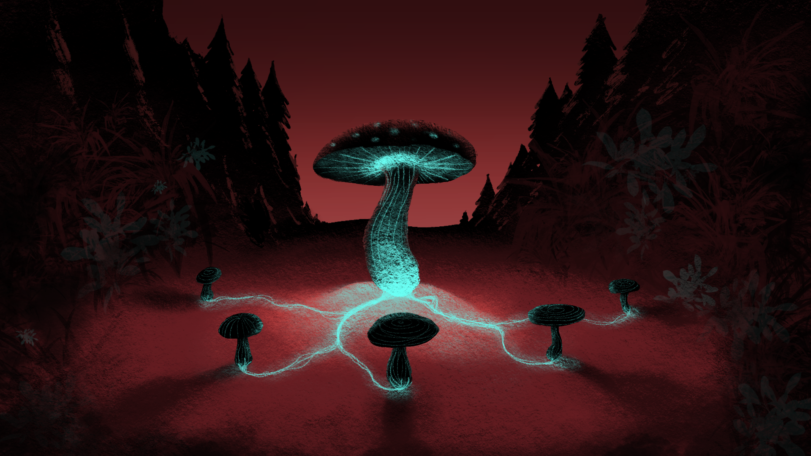

## About this project

[Mycelium Dominion: Antfall](https://couleslaw.itch.io/mycelium-dominion-antfall) is a game developed in 48 hours during [Spring Game Jam @ Matfyz 2024](https://itch.io/jam/spring-game-jam-matfyz-2024). The game is a collection of 3 mini-games, sharing the same theme. The idea is that the player is a zombie fungus, trying to take over the world. The player controls an infected ant and helps the fungus to spread by completing puzzles and challenges.

## How to play

The game is available on [itch.io](https://couleslaw.itch.io/mycelium-dominion-antfall). You can play it in your browser or download it for Windows or Linux.

## Authors

- [Jakub Smolík](https://github.com/couleslaw) - programming (shooter mini-game)
- [Adam Paseka](https://github.com/deinosuch) - programming (platformer mini-game)
- [Jan Hartman](https://github.com/hartmaj2) - programming (maze mini-game)
- [Štěpán Vodseďálek](https://github.com/stephen-vo) - visuals and art design

## Used software

The game was developed using [Godot Engine](https://godotengine.org/) version `4.2.2`. If you want do develop the game further, you can clone the repository and open the project in Godot.
